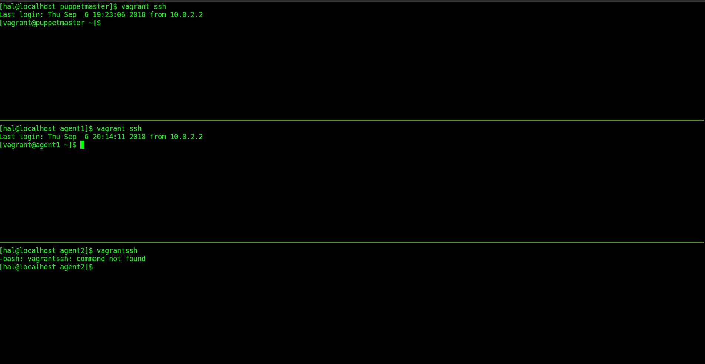

# Puppet Playground 
> Puppetmaster & 2 puppet agents (sandbox dev) 

This setup will give you a working puppetmaster & 2 puppet agents using VAGRANT. Ideal for those who need write & test their puppet modules in development. This project will deply "mediawiki" web application.



## Requirements 
Virtualbox:
https://www.virtualbox.org/wiki/Downloads

Vagrant:
https://www.vagrantup.com/downloads.htm

Vagrant Base Box:
https://atlas.hashicorp.com/centos/boxes/7

For RHEL/CentOS users install these requirements on the host:
```sh
sudo yum -y install kernel-devel
sudo /etc/init.d/vboxdrv setup
```
## Installation

OS X & Linux:

Install the tools in the "Requirements" section.

## Development setup

Build the puppetmaster, and agents with the following commands 

```sh
vagrant up puppetmaster
vagrant up agent1
vagrant up agent2
 
```
Shell into the puppetmaster
```sh
vagrant ssh puppetmaster
```
Create SSL certificates && ensure puppetmaster service is started. 
```sh
sudo puppet master --verbose --no-daemonize
# Ctrl -C to breakout 
sudo systemctl status puppetmaster && sudo systemctl start puppetmaster 
```

Log into the agents and issue the following command, ensure the puppet agent service is DISABLED:
```sh
sudo puppet agent --verbose --no-daemonize --onetime
```

Go back to the puppetmaster and view and accept the pending certficate requests. 
```sh
sudo puppet cert list
```
Sign each cert
```sh
sudo puppet cert sign agent1 && sudo puppet cert sign agent2
```
Reload the agents to clear selinux
```sh
vagrant reload agent1
vagrant reload agent2
```
Deploy the entire 'mediawiki' web application in a single puppet run! Do this on both agents.
```sh
sudo puppet agent --verbose --no-daemonize --onetime
```

In production where the puppet server enviornment is in "noop" mode, use the following tool:
https://linux.die.net/man/1/pssh

Enjoy!
## Release History

* 0.0.1
    * Playground setup

## Meta

Simbalinux – admin@simbatek.net 

[https://github.com/simbalinux/docker](https://github.com/simbalinux/)

## Contributing

1. Fork it (<https://github.com/yourname/yourproject/fork>)
2. Create your feature branch (`git checkout -b feature/fooBar`)
3. Commit your changes (`git commit -am 'Add some fooBar'`)
4. Push to the branch (`git push origin feature/fooBar`)
5. Create a new Pull Request

